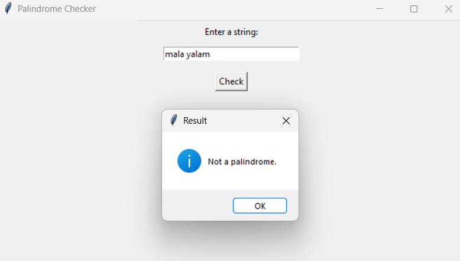
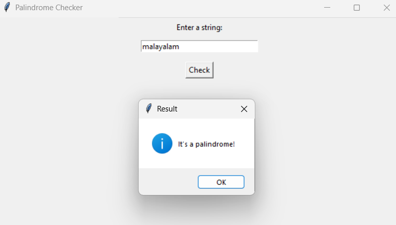

# Palindrome Checker (Tkinter GUI - Strict)

This project is a GUI-based strict palindrome checker built with Python's `tkinter` module.

It checks if the entered string is a **strict palindrome**, meaning it considers:
- **Case sensitivity**
- **Spaces**
- **Punctuation**

---

## How to Use

1. Run the script: `palindrome_checker.py`
2. Enter a string in the text box
3. Click **“Check”** to see the result

---

## Requirements

- Python 3.x  
- Tkinter (included with standard Python installations)

---

## Screenshots

### 1. Input with space – Not a Palindrome  
Strict checker rejects `"mala yalam"` due to space:

### 2. Proper input – Valid Palindrome  
Accepts `"malayalam"` as a palindrome:

