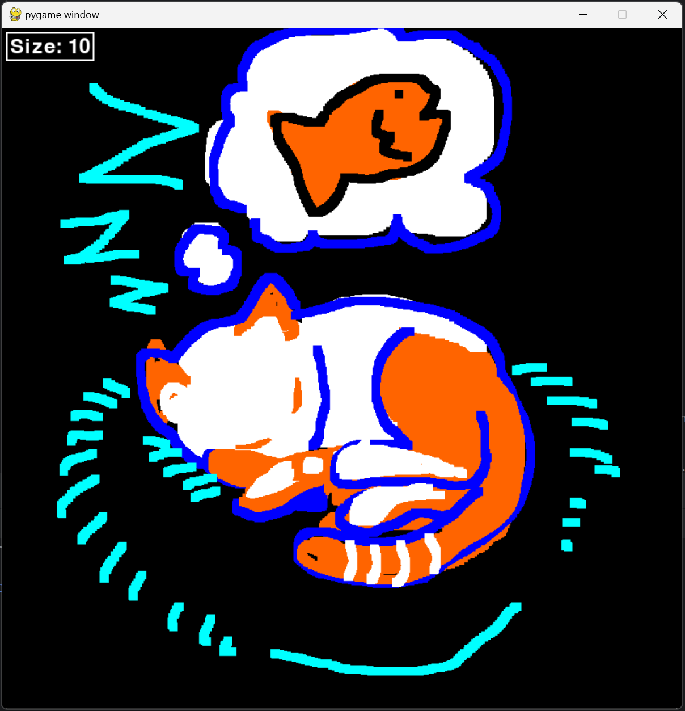
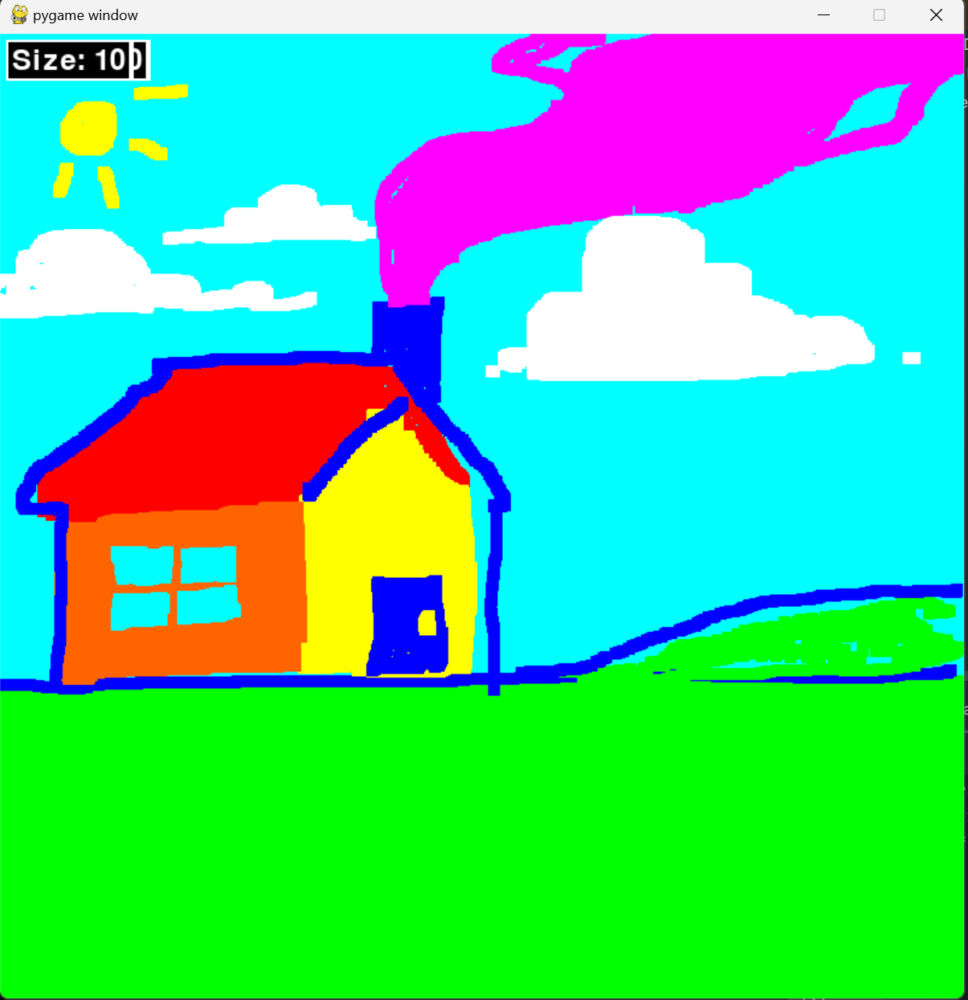

# SmallDraw
SmallDraw is a simple drawing program I wrote up to start learning the Pygame module. This is my first ever OS contribution!

### Prerequisites
Please ensure that you have pygame installed to run this script!
For Windows: run "pip install pygame" in the command prompt 

### How to run the script
After installing pygame, all you have to do is open the script and run the program to start using it!
You can press the r, o, y, g, c, b, m, w keys to change the color of your brush.
Left click to draw, right click to erase the canvas, click the scroll wheel to use the eraser, and scroll up or down to resize the brush. Very simple stuff!

### Screenshot/GIF showing the sample use of the script

## *Author Name*
pinkToGreen
